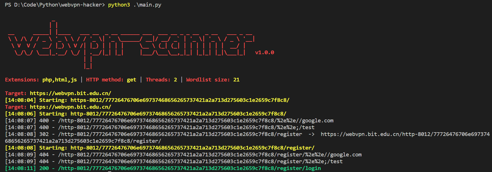

# webvpn-hacker

------

## 0x00 Introduction

&emsp;`webvpn-hacker` is an intranet directory scanner. For the red team, if you want to scan the internal network of an enterprise (usually a school), but its vpn (easyconnect) is not available, only the interface of webvpn is provided externally, then you can use this tool to scan the internal network .

&emsp;The webvpn this tool targets is developed by `wrd tech`, which uses `AES-CBC-128` encryption, and the default key and iv are `wrdvpnisthebest!`. Therefore, for enterprises that have not modified the key and iv, we can convert the internal network url to the public network url.

&emsp;`webvpn-hacker` uses the above principles to scan the intranet.

## 0x01 Usage

**Attention:**`webvpn-hacker` can choose `recursive scanning`, `crawler scanning` and other modes. **Before using it, please write the `cookie` of the enterprise into the header field in `config/config.py`.**

**Step1:** Modify the parameters in `config/config.py` and `config/config.ini`.

**Step2:**`python main.py`. As shown below:

## 0x02 Reference

1.https://github.com/maurosoria/dirsearch

2.https://github.com/ESWZY/webvpn-dlut
